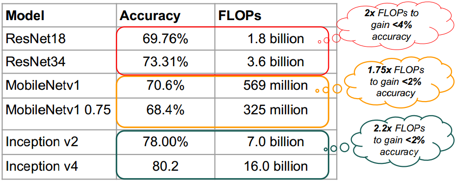
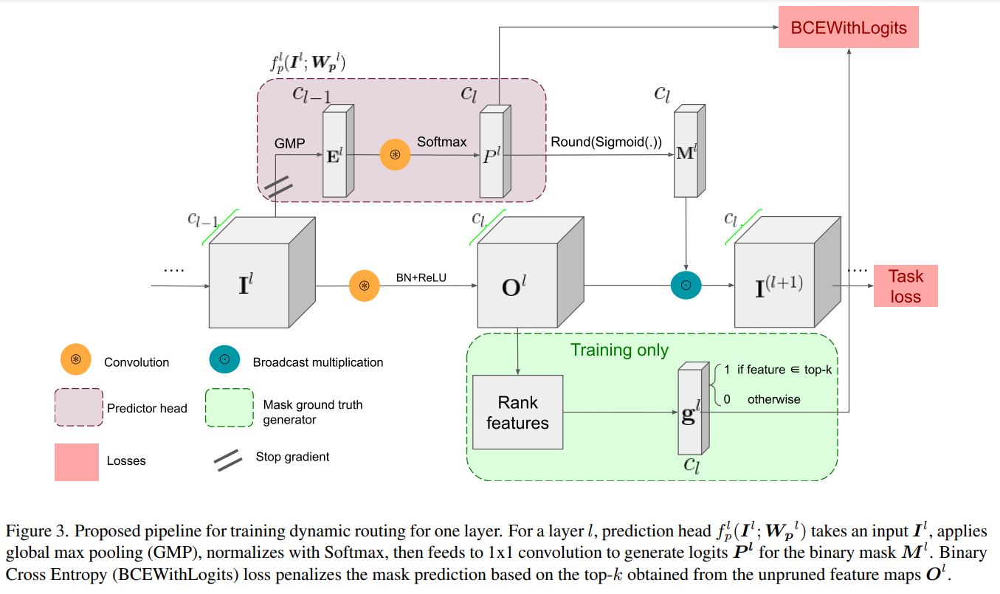
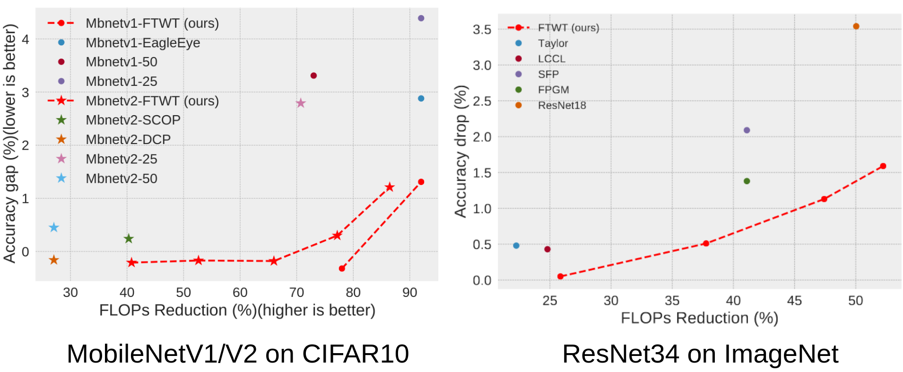
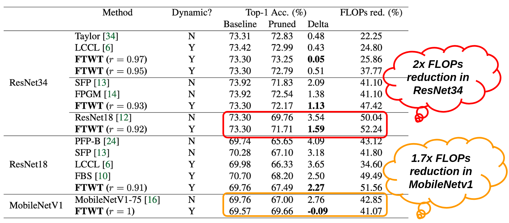

<head>
<link rel="stylesheet" href="https://cdn.jsdelivr.net/npm/katex@0.10.2/dist/katex.min.css" integrity="sha384-yFRtMMDnQtDRO8rLpMIKrtPCD5jdktao2TV19YiZYWMDkUR5GQZR/NOVTdquEx1j" crossorigin="anonymous">

</head>

### Abstract

Dynamic model pruning is a recent direction that allows for the inference of a different sub-network for each input sample during deployment. However, current dynamic methods rely on learning a continuous channel gating through regularization by inducing sparsity loss. This formulation introduces complexity in balancing different losses (e.g task loss, regularization loss). In addition, regularization based methods lack transparent tradeoff hyperparameter selection to realize a computational budget. Our contribution is two-fold: 1) decoupled task and pruning losses. 2) Simple hyperparameter selection that enables FLOPs reduction estimation before training. Inspired by the Hebbian theory in Neuroscience: “neurons that fire together wire together”, we propose to predict a mask to process k filters in a layer based on the activation of its previous layer. We pose the problem as a self-supervised binary classification problem. Each mask predictor module is trained to predict if the log-likelihood for each filter in the current layer belongs to the top-k activated filters. The value k is dynamically estimated for each input based on a novel criterion using the mass of heatmaps. We show experiments on several neural architectures, such as VGG, ResNet and MobileNet on CIFAR and ImageNet datasets. On CIFAR, we reach similar accuracy to SOTA methods with 15% and 24% higher FLOPs reduction. Similarly in ImageNet, we achieve lower drop in accuracy with up to 13% improvement in FLOPs reduction.

### Motivation

Lightweight model perform fairly good in most cases and there tends to be a diminishing returns to adding more FLOPs. Noted in the figure, we gain around 2% accuracy increase with double the computation. 

  

**Question**: Can we only enable the neurons required for each image sample?
Biologically inspired, for different images we look at, different neurons in our brain are fired.

We propose a dynamic inference method to compute different sub-network based on the input samples. Each layer is equipped by a decision gate to select few filters to apply per sample.

### Proposed Method

Let $$\boldsymbol{I^l}$$, $$\boldsymbol{W^l}$$ be the input features, and weights of a convolution layer $$l$$, respectively, where $$\boldsymbol{I^l} \in \mathbb{R}^{c_{l-1} \times w_l \times h_l}$$, $$\boldsymbol{W^l} \in \mathbb{R}^{c_l \times c_{l-1} \times k_l \times k_l}$$, and $$c_l$$ is the number of filters in layer $$l$$. A typical CNN block consists of a convolution operation ($$*$$), batch normalization ($$\rm BN$$), and an activation function ($$f$$) such as the commonly used ReLU. Without loss of generality, we ignore the bias term because of $$\rm BN$$ inclusion, thus, the output feature map $$\boldsymbol{O^l}$$ can be written as $$\boldsymbol{O^l} = f({\rm BN}(\boldsymbol{I^l} * \boldsymbol{W^l}))$$. We predict a binary mask $$\boldsymbol{M^l} \in \mathbb{R}^{c_l}$$ denoting the highly activated output feature maps $$\boldsymbol{O^l}$$ from the input activation map $$\boldsymbol{I^l}$$ by applying a decision head $$f_p^l$$ with learnable parameters $$\boldsymbol{W_p^l}$$. Masked output $$\boldsymbol{I^{l+1}}$$ is then represented as $$\boldsymbol{I^{l+1}} = \boldsymbol{O^l} \odot Binarize(f_p^l(\boldsymbol{I^l};\boldsymbol{W_p}))$$. $$Binarize(.)$$ function is $$round(Sigmoid(.))$$ to convert logits to a binary mask. The prediction of the highly activated output feature maps allows for processing filters $$f$$ where $$M_f^l=1$$ in the inference time and skipping the rest. Our decision head has $$c_{l-1} \times c_{l}$$ FLOPs cost per layer $$l$$ which is negligible.

  

- We propose a novel decision gating loss formulation with self-supervised ground truth mask generation that is stochastic gradient descent (SGD) friendly and decoupled from task loss. Unlike other dynamic inference training methods, a regularization loss is jointly trained with task loss to learn the decision gating. Regularization loss can be hard to tune as pruning ratio increases due to multi-loss gradient interference.
- **During training**, we rank layer’s output features and push the decision gating to predict the **top-k** highly activated features. Top-k is selected based on a hyperparameter **r**.
- **During inference**, we use the binary prediction output from the learned decision gate to perform
handful of filters from the layer based on the input.

### Results

  

Our method (FTWT) achieves higher accuracy on similar accuracy drop, especially on high pruning ratio.

  

**Did we satisfy the motivation?** 

